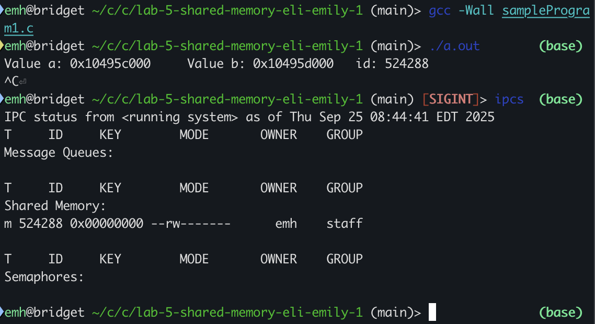
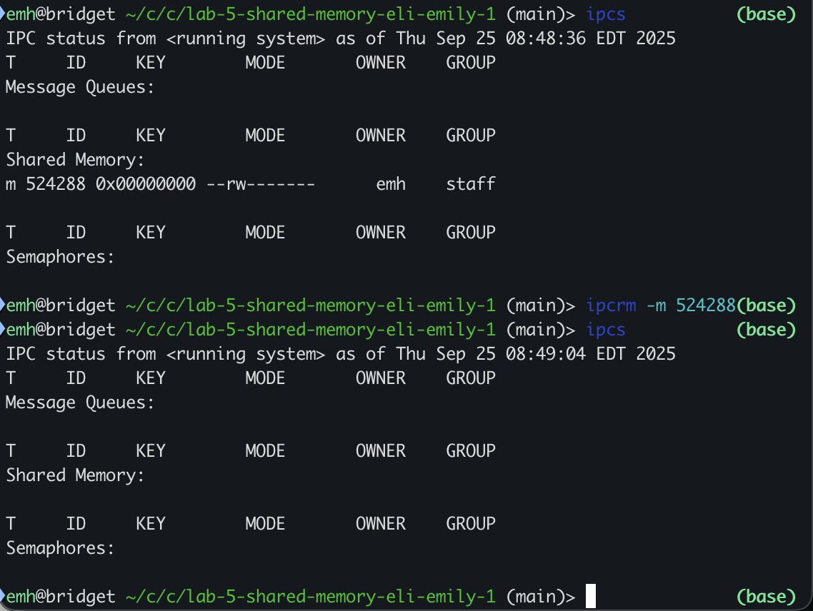

by Emily Heyboer and Eli Morgan

1. The sample programs prints two pointers: one that points to the start of shared memory and one that points to the end (labeled a and b respectively).

2. The function `shmget()` takes 3 parameters: the key, shared memory size, and flags. The key is used to identify the shared memory segment. When passed `IPC_PRIVATE` (like in the sample), `shmget()` will create a new memory segment. Size determines, rounded to the next multiple of `PAGE_SIZE`, how big this memory segment should be. Finally, the flags control the behavior of `shmget()` and the permissions applied to the shared memory. For example, `IPC_CREAT` (which is not necessary in this case), instructs `shmget()` to create a new shared memory segment if one using that key doesn't already exist. The flag also determines shared memory segment permissions (which are similar to file permissions). So in this case, `S_IRUSR` and `S_IWUSR` specify that the user should have read and write access respectively.

3. Two uses of the `shmctl` syscall are:
    1. Read & write information about a `shmid_ds` data structure via the `IPC_STAT` & `IPC_SET` commands.
    2. Gracefully destroy a segment of shared memory via the `IPC_RMID` command.

4. Here's the result of our new changes, where we used `shmctl` to read `shm_segz`.
```
Value a: 0x7fbb02ba4000  Value b: 0x7fbb02ba5000
Size of shared memory: 4096%  
```


5.

